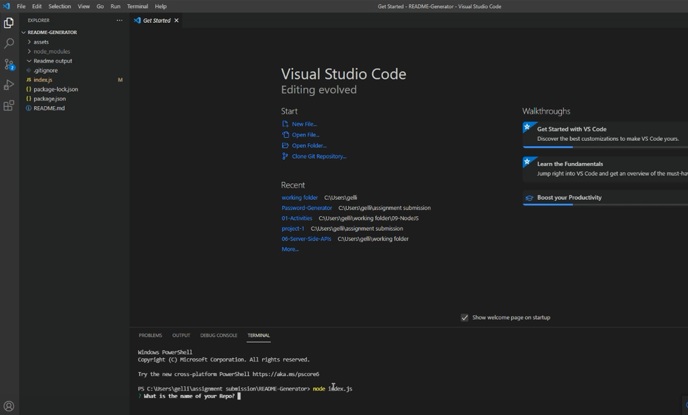
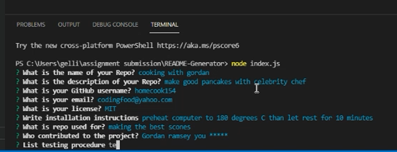
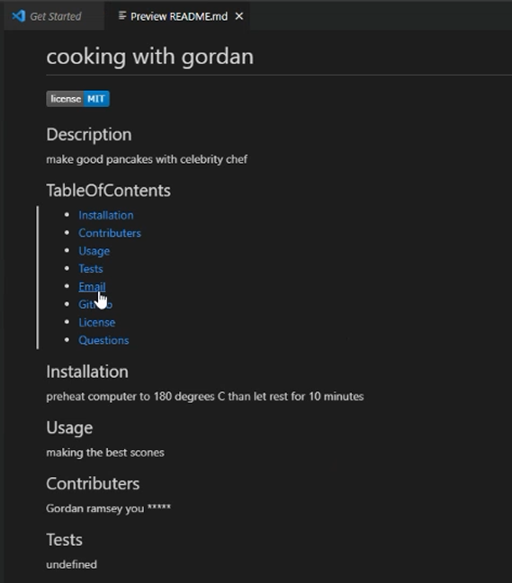

# README-Generator
Generates README files

## When you run the index.js you will be presented with a series of questions

## Keep answering these to fill out your new README file

## Your Readme file will be generated in the README output folder

[Link to How To video](./assets/videos/readme_generator_walkthrough_video.mp4)